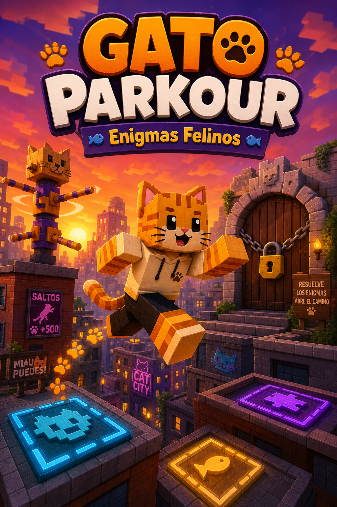

# 🐾 Gato Parkour — Enigmas Felinos



Um jogo de **Roblox** onde você é um **gato**! Corra por telhados, fuja da água,
gire totens, resolva enigmas e escale paredes usando uma física de movimento
feita do zero para imitar o jeito ágil, explosivo e "sempre cai de pé" que um
gato de verdade se move.

Este repositório é um **projeto Rojo** completo (código-fonte 100% em Lua/Luau),
pronto para abrir no Roblox Studio e já vem com o mapa inteiro (hub + 3 zonas +
final) gerado por script — não depende de nenhum asset externo.

---

## 🎮 O jogo

Você acorda no **Hub** (uma vila de gatos) e precisa atravessar 3 zonas temáticas
até chegar ao **Telhado das Estrelas**, resolvendo um enigma diferente em cada uma:

| Zona | Tema | Desafio de parkour | Enigma |
|---|---|---|---|
| 1 — Telhados | Pulos entre telhados em zigue-zague | Pulos de distância/altura variável | **Simon Says felino**: memorize a ordem em que os pisos brilham e pise neles na sequência certa |
| 2 — Jardim Secreto | Canais de água (gatos odeiam água!) | Pedras de apoio sobre a água | **Totens giratórios**: gire 3 totens (tecla `E`) até todos apontarem na direção certa |
| 3 — Sótão Misterioso | Corredor de *wall-jump* + plataformas móveis | Escalar paredes alternadas, pegar timing das pranchas | **Painel numérico**: ache os 3 ratinhos escondidos nas vigas para descobrir o código e destrancar a porta |

No final, seu tempo de corrida é cronometrado e comparado com seu melhor tempo.

---

## 🐈 Física do gato (o coração do projeto)

Tudo isso foi implementado **do zero** em `CatController.client.lua` — o
personagem não usa o pulo/gravidade padrão do Roblox, só a física custom:

- **Pulo com altura variável** — toque rápido = pulo curto, segure = pulo mais alto.
- **Salto Pounce** — agache (`Ctrl`) e pule para um salto maior e mais longe, como um gato se lançando sobre a presa.
- **Controle aéreo forte** — gatos são incrivelmente ágeis no ar; dá pra corrigir a trajetória em pleno pulo.
- **Gravidade assimétrica** — sobe com a física normal, mas cai mais forte/decidido (`FallGravityMultiplier`), gerando aquela sensação de queda "comprometida" de gato.
- **Reflexo de endireitamento** — o gato sempre tenta ficar de pé, mesmo em quedas longas.
- **Pouso com squash & stretch** — ao aterrissar, o corpo achata e estica rapidinho (usando os `NumberValues` de escala do Humanoid R15), simulando a absorção de impacto real de um gato.
- **Quedas muito altas atordoam** (sem tirar vida — gatos não sofrem "dano de queda", mas ficam tontos um instante).
- **Wall Jump** — pule fora de paredes no ar para escalar corredores estreitos.
- **Ledge Mantle** — escale automaticamente uma beirada na altura do peito, como um gato se puxando por uma borda.
- **Sprint com fôlego (stamina)** — corrida explosiva e curta, que gasta rápido e recupera com calma (fôlego de gato, não de maratonista).
- **Rabo e orelhas animados** — o rabo reage à aceleração do corpo (efeito contrapeso) e as orelhas "tremem" ao pousar.

> ⚠️ **Sobre o "tuning"**: todas essas constantes (força de pulo, distância de
> parede, gravidade etc.) ficam centralizadas em
> `src/ReplicatedStorage/Shared/CatConfig.lua`. As distâncias das plataformas do
> mapa foram calculadas a partir desses valores, mas **o ajuste fino final
> (feel do pulo, distância exata dos vãos) deve ser feito jogando dentro do
> Roblox Studio**, já que este ambiente de geração de código não roda o motor
> de física do Roblox para playtestar automaticamente. Se algum pulo estiver
> muito fácil/difícil, mexa nos números do `CatConfig` ou reposicione as
> plataformas em `MapBuilder.lua` (tudo comentado e em tabelas simples).

---

## 🕹️ Controles

| Tecla | Ação |
|---|---|
| `W A S D` | Mover |
| `Espaço` | Pular (segure para pular mais alto) |
| `Ctrl` + `Espaço` | Salto Pounce (agache e pule) |
| `Shift` | Correr (gasta fôlego) |
| `E` | Interagir (girar totens) |
| `R` | Voltar para o último checkpoint |
| Clique | Usar o painel numérico |

Também funciona com controle (gamepad) e touch (mobile), via `ContextActionService`.

---

## 📁 Estrutura do projeto

```
default.project.json          # Configuração do Rojo (mapeia pastas -> serviços do Roblox)
aftman.toml                   # Pin de versão do Rojo (opcional)
src/
  ReplicatedStorage/
    Shared/
      CatConfig.lua           # TODAS as constantes de física/jogabilidade
  ServerScriptService/
    Server/
      Main.server.lua         # Ponto de entrada do servidor
      MapBuilder.lua          # Gera o mapa inteiro por código (hub + 3 zonas + final)
      CatRigService.lua       # Transforma o personagem R15 em "gato" (escala, orelhas, rabo)
      CheckpointService.lua   # Sistema de checkpoints / respawn
      HazardService.lua       # Água (gatos odeiam água!)
      PuzzleService.lua       # Lógica dos 3 enigmas
      RaceService.lua         # Cronômetro e melhor tempo
  StarterPlayer/
    StarterPlayerScripts/
      CatController.client.lua   # Física custom de movimento (o coração do projeto)
      CameraController.client.lua# FOV dinâmico + leve tilt de câmera
      HUDController.client.lua   # Toda a interface (timer, stamina, toasts, tela final)
      PuzzleClient.client.lua    # Liga os botões do painel numérico ao servidor
    StarterCharacterScripts/
      CatVisualEffects.client.lua# Rabo, orelhas e passos de pata
```

---

## ▶️ Como abrir e jogar

### Opção A — Rojo (recomendado, mantém tudo em código/GitHub)

1. Instale o **Roblox Studio**.
2. Instale o **plugin do Rojo** no Studio (loja de plugins, procure "Rojo").
3. Instale a CLI do Rojo na sua máquina:
   - Com [Rokit](https://github.com/rojo-rbx/rokit) ou [Aftman](https://github.com/LPGhatguy/aftman): rode `rokit install` (ou `aftman install`) dentro da pasta do projeto — ele lê o `aftman.toml` e instala a versão certa.
   - Ou baixe o binário direto em https://github.com/rojo-rbx/rojo/releases.
4. Clone este repositório e, na pasta do projeto, rode:
   ```bash
   rojo serve
   ```
5. No Roblox Studio, abra o plugin Rojo e clique em **Connect**.
6. Pronto — o mapa inteiro, os scripts e os enigmas aparecem no jogo. Clique em ▶ **Play** para testar.

### Opção B — Copiar manualmente

Se preferir não usar Rojo, você pode criar os Scripts/ModuleScripts manualmente
no Studio nos mesmos caminhos indicados na estrutura acima e colar o conteúdo
de cada arquivo `.lua`. É mais trabalhoso, mas funciona.

---

## 🧠 Detalhes técnicos dos enigmas

- **Sequência de memória (Zona 1)**: `PuzzleService.CreateSequencePuzzle` sorteia
  uma sequência de 4 pisos, acende-os em ordem, e valida os passos dos jogadores
  via `.Touched`. Errar reinicia a rodada.
- **Totens giratórios (Zona 2)**: cada totem usa um `ProximityPrompt` (tecla `E`)
  que gira 90° por clique (`TweenService`). Quando os 3 totens atingem o índice
  alvo configurado, o portão abre.
- **Painel numérico (Zona 3)**: os 3 "ratinhos" escondidos revelam um dígito do
  código quando tocados. Um `SurfaceGui` no mundo funciona como teclado; os
  cliques são capturados no cliente (`PuzzleClient.client.lua`) e validados no
  servidor (`PuzzleService.CreateKeypadPuzzle`), sem confiar em nada vindo do
  cliente além do código digitado.

Todos os "portões" das zonas usam a mesma função `openGate()`: eles afundam no
chão e ficam sem colisão quando o enigma correspondente é resolvido.

---

## 🔧 Possíveis próximos passos

- Adicionar animações R15 customizadas (idle/andar/pular) específicas de gato.
- Persistir o melhor tempo por jogador via `DataStoreService` (já tem um esqueleto pronto e protegido por `pcall` em `RaceService.lua`, só falta publicar o jogo com "Enable Studio Access to API Services" ligado).
- Mais zonas/enigmas (o padrão em `MapBuilder.lua` é fácil de estender).
- Skins de gato (cores/padrões de pelagem) selecionáveis no Hub.

---

## 📜 Licença

Sinta-se livre para usar, modificar e publicar este projeto no Roblox.
