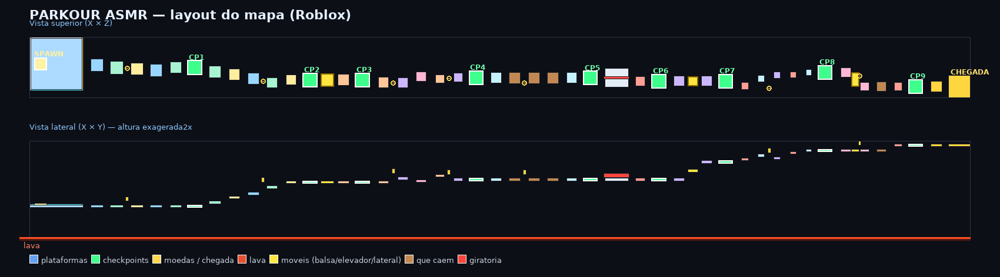

# 🏔️ PARKOUR ASMR — mapa para Roblox Studio

Mapa de parkour completo e **satisfatório**, com **ASMR de teclado** (cliques suaves a cada tecla,
passinhos, pulo, aterrissagem), HUD animado, checkpoints, moedas, obstáculos e comemoração com
confete. Tudo em um único arquivo pronto para importar.



---

## ⬇️ Como importar no Roblox Studio

1. Baixe o arquivo **`Parkour_ASMR.rbxlx`**.
2. Abra o **Roblox Studio**.
3. Vá em **Arquivo → Abrir do arquivo...** e selecione o `Parkour_ASMR.rbxlx`
   (ou simplesmente **arraste o arquivo para dentro do Studio**).
4. O mapa já aparece no Explorer, organizado em `Workspace → ParkourMap`.
5. Aperte **F5 (Play)** para testar. Divirta-se!
6. Quando quiser publicar: **Arquivo → Publicar no Roblox...**

> O arquivo é um place no formato XML do Roblox (`.rbxlx`) — é o mesmo formato que o próprio
> Studio gera em "Salvar como...". Nada de plugin ou conversor.

---

## 🎮 Controles e o que tem no mapa

| Controle | Efeito |
|---|---|
| **WASD** | andar (com cliques ASMR a cada tecla) |
| **ESPAÇO** | pular (com som de pulo/aterrissagem) |
| **SHIFT** | correr |
| **K** | ligar/desligar o som ASMR do teclado |
| **R** | reiniciar o personagem |

**Conteúdo do percurso:**

- 🟩 **9 checkpoints** — ao tocar, o pad brilha, toca um "ping" e você renasce nele
- 🪙 **7 moedas** girando (pegue desviando do caminho principal)
- 🌋 **Lava** cobrindo o chão inteiro (morte ao toque + brasas subindo)
- 🚡 **3 plataformas móveis** — balsa lateral, elevador vertical e balsa em Z
- 💥 **4 plataformas que tremem e caem** (você tem ~2 segundos)
- ❌ **1 giratória mortal** — barra neon girando; salte na hora certa (os cantos do pad são seguros)
- 🏁 **Chegada** com confete, fanfarra e tela de comemoração
- 📊 **HUD** com barra de progresso, contador de moedas e pop-up de checkpoint
- 🪧 Placas de boas-vindas/controles, iluminação de fim de tarde, bloom nos neons

Dificuldade pensada para ser **satisfatória, não raivosa**: pulo médio de ~5 studs
(máximo ~7,5 — o personagem alcança ~8,5 correndo).

---

## 🔊 Sobre os sons ASMR

Os sons vêm de **áudios clássicos embutidos do próprio Roblox** (`rbxasset://sounds/...`),
então funcionam **sem upload nenhum**. Se algum caminho parar de existir num futuro cliente,
o script testa automaticamente alternativas.

Para usar **seus próprios áudios ASMR** (ex.: gravações de teclado mecânico):

1. No Studio: `StarterPlayer → StarterPlayerScripts → ASMRKeyboard` (dê dois cliques).
2. No topo do script existe a tabela `CUSTOM`:

```lua
local CUSTOM = {
    key = "",        -- clique do teclado
    step = "",       -- passinhos
    jump = "",       -- pulo
    land = "",       -- aterrissagem
    coin = "",       -- moeda
    checkpoint = "", -- checkpoint
    finish = "",     -- chegada
    music = "",      -- música de fundo em loop (opcional)
}
```

3. Cole o ID no formato `rbxassetid://1234567890` e dê Play de novo.

> ⚠️ **Licenciamento de áudio:** desde 2022 o Roblox só permite reproduzir áudios que a sua
> conta possui (enviados por você ou copiados da Creator Store para a sua conta). Use áudios
> seus ou licenciados — IDs aleatórios de terceiros podem simplesmente não tocar.

---

## 🗂️ Estrutura do place

```
Workspace
└── ParkourMap (Model)
    ├── Lobby          → base, spawn e faixa de largada
    ├── Course
    │   ├── Platforms        (34 plataformas + circuito)
    │   ├── Checkpoints      (Checkpoint_1 … Checkpoint_9)
    │   ├── Movers           (balsa, elevador, lateral)
    │   ├── FallingPlatforms (que caem)
    │   ├── Spinners         (giratória)
    │   ├── Coins            (Coin_1 … Coin_7)
    │   └── Finish
    ├── Decor          → placas (criadas em runtime)
    └── Hazards        → Lava_Floor

ServerScriptService
├── GameCore   → checkpoints, moedas, perigos, obstáculos, chegada
└── MapSetup   → placas, luzes, brasas e confete

StarterPlayer.StarterPlayerScripts
├── ASMRKeyboard → sons de teclado/passo/pulo + toggle (K)
└── ParkourHUD   → barra, moedas, pop-ups e tela de vitória
```

---

## 🛠️ Reeditar / regenerar (opcional)

O mapa é gerado por código — se quiser mexer na dificuldade (gaps, tamanhos, cores):

```bash
cd parkour-asmr
python3 build_parkour.py     # regenera Parkour_ASMR.rbxlx
```

- `build_parkour.py` — layout do curso + montagem do XML
- `src/gamecore.lua` — lógica do servidor
- `src/mapsetup.lua` — decorações do mapa
- `src/asmr.lua` — sons ASMR (client)
- `src/hud.lua` — HUD (client)

Os quatro scripts são validados sintaticamente na geração.

---

## ❓ Problemas comuns

| Sintoma | Solução |
|---|---|
| Nenhum som ao andar | Você está na edição — aperte **F5**. Veja se o selo mostra "ASMR: LIGADO" (tecla **K**) |
| Um som específico não toca | Provável caminho de áudio aposentado em algum cliente — troque pelo seu ID em `CUSTOM` |
| O arquivo não abre arrastando | Use **Arquivo → Abrir do arquivo...** (é um place, não um modelo) |
| Quer começar do zero sem perder progresso | Checkpoints duram a sessão; **R** reinicia o personagem (volta ao último CP) |
| Multiplayer | Moedas são compartilhadas na sessão (se alguém pega, some para todos) |
